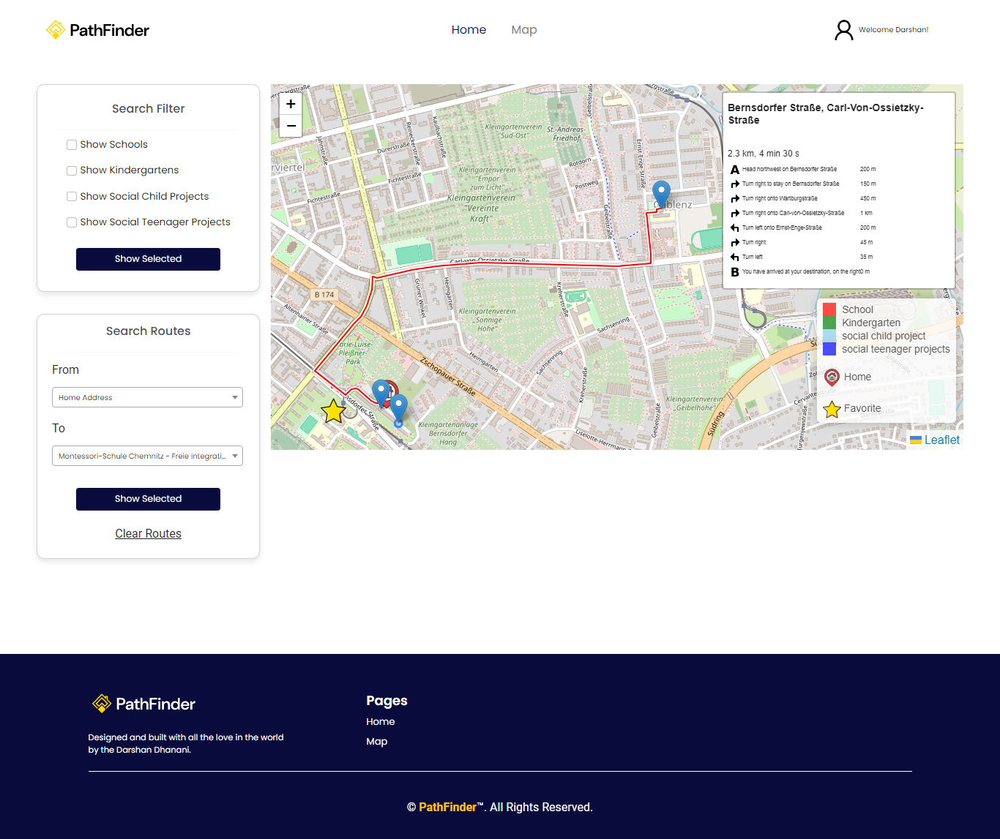

# Path Finder - Interactive Map Application

Path Finder is a web application designed to enhance access to information about various facilities in Chemnitz. It leverages the Chemnitz Open Data Portal to provide users with interactive map functionalities, including live location visibility, route planning, and facility categorization.

## Technologies Used
- **Frontend:** HTML, CSS, JavaScript, Jinja2 (for dynamic templating with Flask)
- **Backend:** Flask (Python web framework)
- **Database:** MongoDB (NoSQL database)
- **External Services:** Mailtrap for email testing, Leaflet for interactive maps

## Prerequisites
Ensure Python is installed on your system. Download it from [Python's official website](https://www.python.org/).

## Application Setup and Running Instructions

### Step 1: Clone the Repository
```bash
git clone https://github.com/darshan-1611-dev/PathFinder.git
cd PathFinder
```

### Step 2: Create a Virtual Environment
```bash
python -m venv venv
source venv/bin/activate   # On Linux/macOS
venv\Scripts\activate     # On Windows
```

### Step 3: Install Dependencies
```bash
pip install -r requirements.txt
```

### Step 4: Run the Application
```bash
python main.py
```

## Application Functionalities
1. **User Authentication**: Registration, Login, and Forgot Password
2. **User Profile Management**: Edit profile, set home address, and delete profile
3. **Interactive Map Interface**:
   - Filter facilities by categories (e.g., schools, kindergartens, social projects)
   - View routes between facilities
   - Mark favorite facilities
   - View live location

## Screenshots

### Login Page


### Map Interface




### User Profile


## Endpoints Documentation
- `/login`: User login (GET, POST)
- `/register`: User registration (GET, POST)
- `/forgot-password`: Password reset (GET, POST)
- `/user-profile`: View user profile (GET)
- `/edit-profile`: Edit user profile (GET, POST)
- `/delete-profile`: Delete user account (GET)
- `/map`: Interactive map view (GET)
- `/map-json-data`: Fetch map data (GET)
- `/mark-as-favorite-facility/<facility_id>/<facility_name>`: Mark facility as favorite (POST)
- `/remove-as-favorite-facility/<facility_id>/<facility_name>`: Remove facility from favorites (POST)
- `/fetch-favorite-facility`: Fetch user's favorite facilities (GET)

## References
1. [Chemnitz Open Data Portal](https://portal-chemnitz.opendata.arcgis.com/)
2. [Flask Documentation](https://flask.palletsprojects.com/en/3.0.x/)
3. [MongoDB Documentation](https://www.mongodb.com/)
4. [Leaflet Maps Library](https://leafletjs.com/reference.html)
5. [Mailtrap for Email Testing](https://mailtrap.io/)

## License
This project is licensed under the MIT License.

